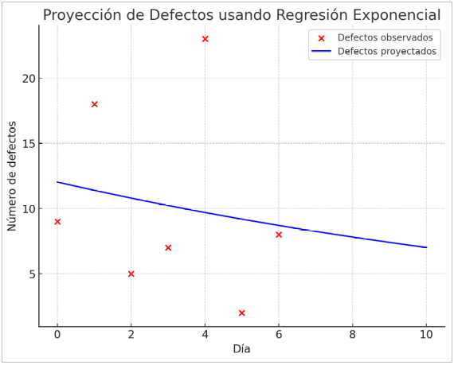

## Requerimientos

### Funcionales (R)

1. Solicita y acepta un número entero positivo
2. Valida que el número ingresado sea mayor a 0 y menor a 2000
3. Debe contar las iteraciones que se realicen hasta conseguir el valor 1
4. Si el número es par lo divide por 2
5. Si el número es impar lo multiplica por 3 y le suma 1
6. Si el número es 1 retorna la cantidad de iteraciones

### No funcionales (F)

## Test cases (T)

### Caja negra

1. Solicita un número
2. Valida que el número sea mayor a cero
3. Valida que el número sea menor o igual a 1999
4. Devuelve un integer (cantidad de iteraciones)
5. Si el número es 1 devuelve cero iteraciones
6. Si el número es 2 devuelve una iteración
7. Si el número es 3 devuelve siete iteraciones
8. Si el número es 1999 devuelve cincuenta iteraciones

### Caja blanca

9. Mientras el número no sea 1, si es par se divide por 2
10. Mientras el número no sea 1, si es impar se multiplica por 3 y se le suma 1
11. Si el número es 1 se retornan las iteraciones

## RTMX

| R - T | 1 | 2 | 3 | 4 | 5 | 6 | 7 | 8 | 9 | 10 | 11 |
|:-----:|:-:|:-:|:-:|:-:|:-:|:-:|:-:|:-:|:-:|:--:|:--:|
| 1     | x |   |   |   |   |   |   |   |   |    |    |
| 2     |   | x | x |   |   |   |   |   |   |    |    |
| 3     |   |   |   |   | x | x | x | x |   |    |    |
| 4     |   |   |   |   |   |   |   |   | x |    |    |
| 5     |   |   |   |   |   |   |   |   |   | x  |    |
| 6     |   |   |   | x |   |   |   |   |   |    | x  |

## Sesiones

1. Se encontró un defecto
2. Se encontraron tres defectos

## PCE y Densidad

Inspección: 1 / 4 = 0.25
Pruebas unitarias: 3 / 4 = 0.75
Pruebas funcionales: 0 / 4 = 0

Densidad de defectos: 4 / 18 = 0.2222

## TEP

Las siglas TEP significan Trabajo en Progreso (Work in progress), y tiene tiene un significado crítico ya que si aumentamos el trabajo en proceso, o sea las tareas que se estén realizando, pero no aumentamos el rendimiento, esto lleva a que plazo de ejecución se extienda. La idea entonces es bajar el TEP y aumentar el rendmiento, así el plazo de ejecución desciende.

